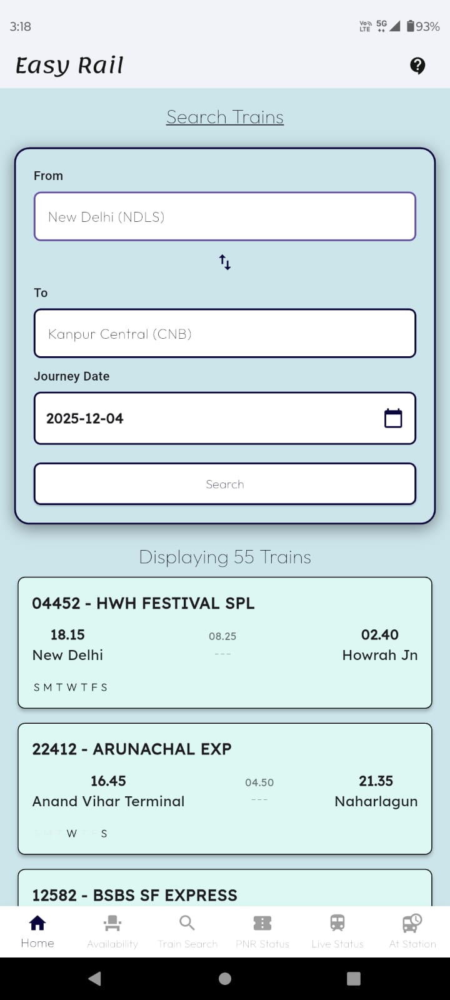
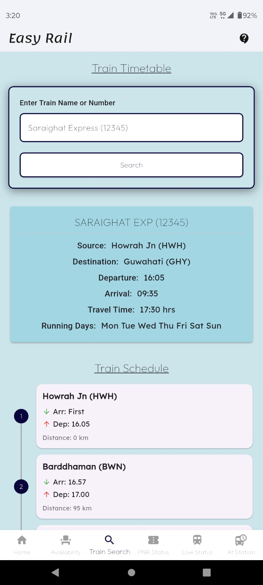
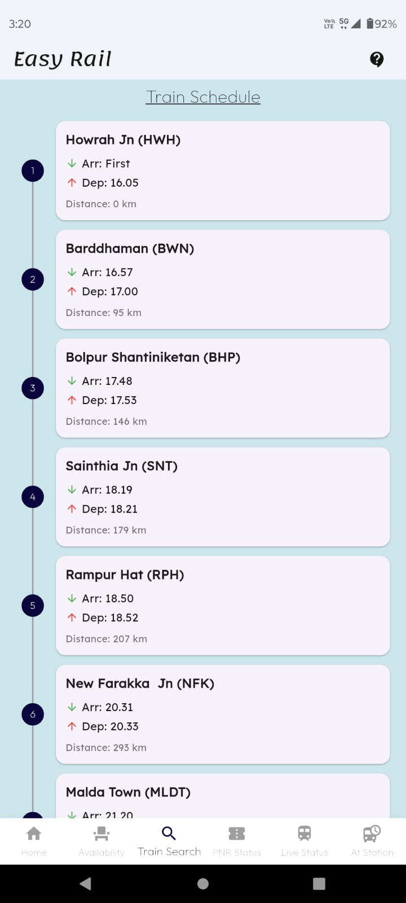
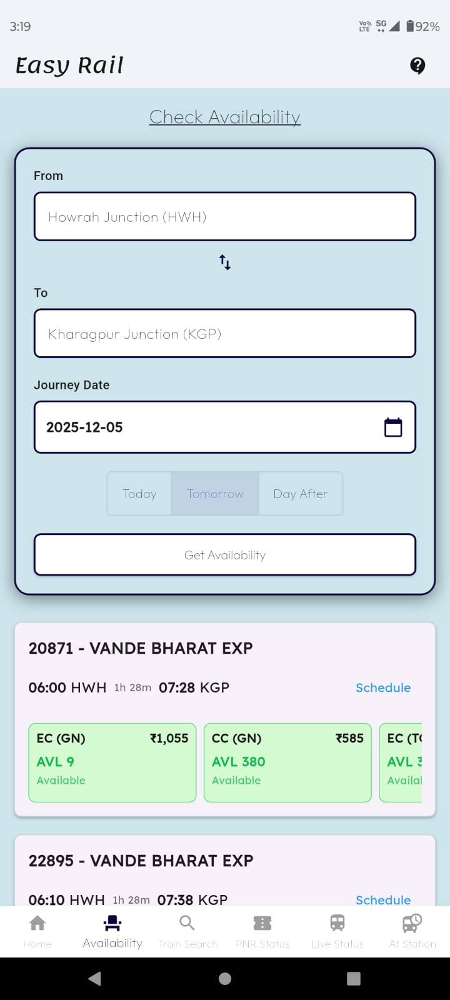
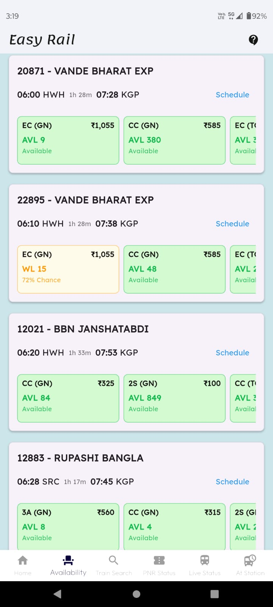
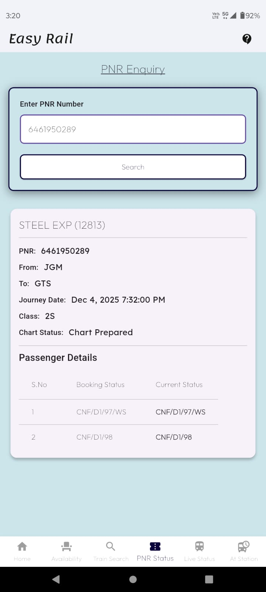
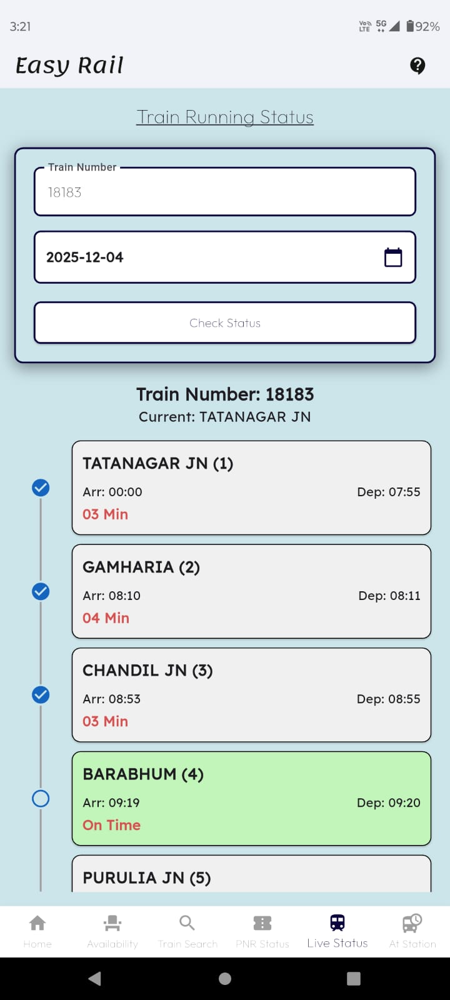
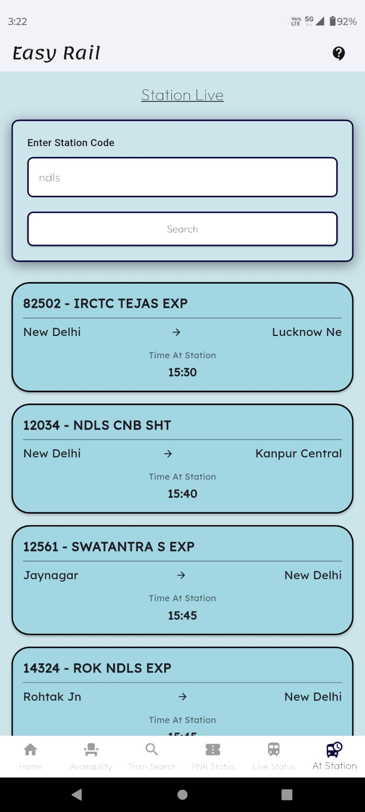

# Easy Rail 🚆

A comprehensive Indian Railways information app built with Flutter. Easy Rail provides real-time train information, seat availability, PNR status, and live train tracking - all in one beautiful, user-friendly interface.

> **Inspired by:** [Easy-Rail](https://github.com/RAJIV81205/Easy-Rail) - A web-based railway information system

## 📹 Demo

<div align="center">
  <a href="https://youtube.com/shorts/q-T9eZis8eU">
    
  </a>
</div>

## 📸 Screenshots

<div align="center">
  
  
  
  
</div>

<div align="center">
  
  
  
  
</div>

## ✨ Features

### 🔍 Search Trains
- Search trains between any two stations
- View detailed train schedules and routes
- See running days for each train
- Beautiful station timeline with arrival and departure times
- Swap stations with a single tap

### 🎫 Check Seat Availability
- Real-time seat availability across all classes
- Quick date selection (Today, Tomorrow, Day After)
- View quota-wise availability (General, Tatkal, Ladies, etc.)
- One-tap access to train schedules from availability results

### 🔢 PNR Status
- Check current PNR status
- View booking details and passenger information
- Track chart preparation status

### 📍 Live Train Status
- Get real-time train location and delays
- View updated arrival/departure times at each station
- Track train delays in minutes

### 🚉 Station Live
- View all trains arriving/departing from any station
- Real-time platform information
- Expected arrival and departure times

### 🕐 Train Schedule
- Complete train route with all station stops
- Distance covered at each stop
- Arrival and departure times
- View which days the train runs

## 🚀 Getting Started

### Prerequisites
- Flutter SDK (3.24.5 or higher)
- Dart SDK
- Android Studio / VS Code
- Java 17 for Android builds

### Installation

1. Clone the repository:
```bash
git clone https://github.com/yourusername/easy_rail_app.git
cd easy_rail_app
```

2. Install dependencies:
```bash
flutter pub get
```

3. Run the app:
```bash
flutter run
```

### Building Release APK

Build universal APK:
```bash
flutter build apk --release
```

Build split APKs (recommended for smaller file sizes):
```bash
flutter build apk --split-per-abi
```

### 📦 APK Installation Guide

When building split APKs, three different APK files are generated. Choose the right one for your device:

| APK File | Target Devices | Examples | When to Use |
|----------|----------------|----------|-------------|
| **app-arm64-v8a-release.apk** | Modern Android devices (2017+) | Samsung Galaxy S8+, OnePlus 5+, Pixel 2+, Xiaomi 2017+ | ✅ **Recommended** for 95% of users with newer devices |
| **app-armeabi-v7a-release.apk** | Older Android devices (2011-2017) | Samsung Galaxy S7 and older, budget phones | Use if your device is 32-bit or doesn't support arm64 |
| **app-x86_64-release.apk** | Emulators & x86 devices | Chromebooks, Intel tablets, Android Studio emulator | Use if running on emulator or Intel-based device |
| **app-release.apk** (Universal) | All devices | Any Android device | Use if unsure or for maximum compatibility |

**Not sure which one to use?**
1. Try **arm64-v8a** first (works on most modern devices)
2. If it doesn't install, try **armeabi-v7a**
3. If you're on an emulator, use **x86_64**
4. If still unsure, use the **universal APK**

## 🏗️ Architecture

- **State Management:** Provider pattern
- **API Integration:** ConfirmTkt API for real-time data
- **Local Data:** JSON-based station and train database
- **UI Framework:** Material Design with custom theming

## 📁 Project Structure

```
lib/
├── main.dart                 # App entry point
├── models/                   # Data models
├── providers/                # State management
├── screens/                  # UI screens
├── services/                 # API & data services
├── utils/                    # Constants & themes
└── widgets/                  # Reusable components
```

## 🎨 Design

- Clean, modern UI with consistent styling
- Light blue theme (#CCE5EB)
- Shadow effects and smooth animations
- Responsive layouts for all screen sizes

## 🤝 Contributing

Contributions are welcome! Please feel free to submit a Pull Request.


## 🙏 Acknowledgments

- Inspired by [Easy-Rail](https://github.com/RAJIV81205/Easy-Rail) by RAJIV81205
- Data powered by ConfirmTkt API
- Icons from Material Design Icons

## 📧 Contact

For questions or feedback, please open an issue on GitHub.

---

**Note:** This app uses third-party APIs for train data. Ensure you comply with their terms of service.
